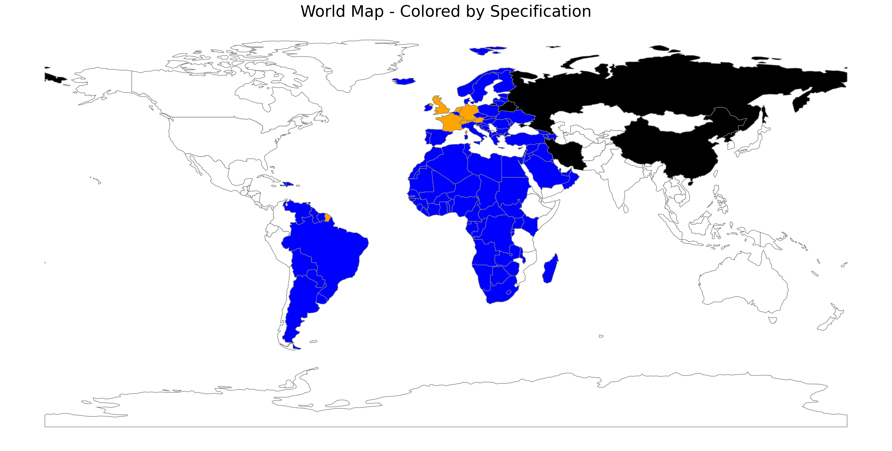

# 🌍 World Map Coloring Project

This project generates a custom world map where countries are colored based on specific rules:

- 🟠 **Orange**: France, Germany, United Kingdom, Netherlands, Switzerland, Austria
- ⚫ **Black**: China, Russia, Belarus, Iran, North Korea
- 🔵 **Blue**: Countries located between UTC-4 and UTC+4
- ⚪ **White**: All other countries

---

## 📷 Project Preview

---

## 🚀 How to use

1. Open the [`world_map_coloring.ipynb`](world_map_coloring.ipynb) notebook.
2. Run all cells in **Google Colab** (or another Jupyter environment).
3. The colored world map will be generated and saved as `colored_world_map.png`.

> 🛠️ Requirements (`pip install geopandas matplotlib`) are installed automatically if using Colab.

---

## 📥 Download

The generated image will be saved locally as `colored_world_map.png`.

---

## 📜 License

This project is open-source and free to use.  
Feel free to clone, modify, and share it!

---
